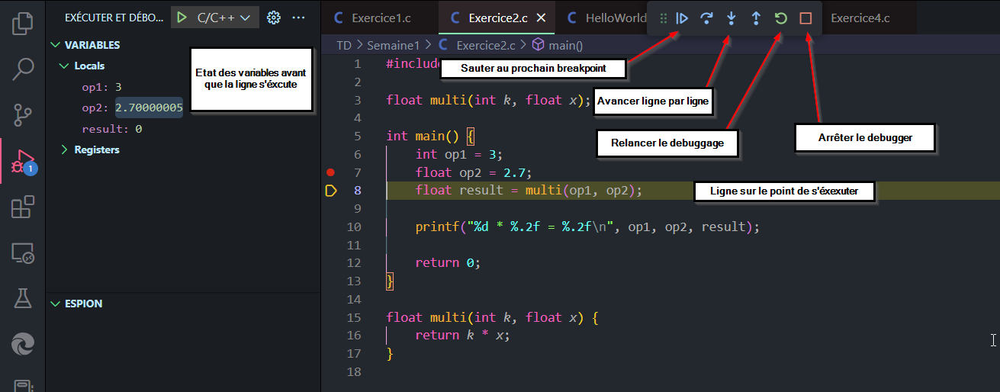

# Un environnement adéquat pour coder en C

## Introduction
Il s'agit ici d'un petit article pour aider chacun à avoir un environnement convenable pour coder en C (et peut être dans d'autres langages dans le futur).   

Mais si cet article se veut **le plus complet possible**, sachez qu'il est impossible de répondre à tous les besoins...  
C'est donc **A VOUS** d'effectuer vos recherches par la suite et d'attiser votre curiosité pour améliorer cet environnement et en faire vraiment le vôtre. ;)  

## Le WSL (Pour windows)

Il est important pour les utilisateurs de Windows de savoir que programmer en C sur Windows est quasiment impossible à faire dans les conditions optimales.  
Les développeurs de chez Microsoft semble être également d'accord sur ce point et ont inventé le **WSL** (Windows Subsystem Linux).  

### Qu'est ce que c'est ?

Un *WSL* est une machine virtuelle qui va s'exécuter sur votre ordinateur, en fait, c'est un peu comme si un ordinateur s'exécutait sur votre ordinateur. Cette machine virtuelle abritera un système Linux qui vous permettra de disposer de tous les outils nécéssaire pour programmer.

⚠️ **ATTENTION !** Même si le WSL semble fantastique, il ne remplace pas un véritable système Linux ! Si vous envisagez de programmer plus sérieusement plus tard, voyez ceci comme un moyen de tâter le terrain avant de basculer sur Linux et non pas comme un échappatoire !

### Comment l'obtenir ?

Il est très facile d'obtenir un WSL ayant Ubuntu sur le [Microsoft Store](https://www.microsoft.com/store/productId/9PDXGNCFSCZV).  

Si vous souhaitez utiliser une distro Linux différente, un bon point de recherche pour comprendre le fonctionnement serait de suivre [ce tutoriel pour installer Fedora sur WSL](https://dev.to/bowmanjd/install-fedora-on-windows-subsystem-for-linux-wsl-4b26)

> *C'est personnellement celui que j'ai suivi pour mettre Fedora, qui est globalement plus agréable à utiliser que Ubuntu*  


### Et après ?
Si vous avez réussi à installer Ubuntu sur votre Windows, vous pouvez l'exécuter en tapant `Ubuntu` dans votre barre de recherche... N'hésitez pas à [épingler votre WSL à votre barre de tâche](https://support.microsoft.com/fr-fr/windows/%C3%A9pingler-une-application-%C3%A0-la-barre-des-t%C3%A2ches-65faa478-5e98-3b74-c6b6-1be3f5b67ed0), ça vous évitera de le chercher ! ;)  

Au premier lancement vous serez accueillis par un champ à renseigner:  
`Enter UNIX name`, entrez votre prénom et nom, sans espace et de préférence sans majuscule.  

> *En réalité, vous pouvez faire comme bon vous semble, mais il s'agit d'une [norme très répandue dans Linux](https://fr.wikipedia.org/wiki/POSIX)*

Ensuite, vous devrez renseigner un mot de passe...  
⚠️ **IL EST IMPORTANT DE S'EN SOUVENIR ! CELUI-CI EST IRRECUPERABLE ET TRES IMPORTANT !!**  

**NB:** Vous serez probablement surpris de constater que malgré le fait que vous tapiez sur votre clavier, il ne semble pas y avoir de caractère qui s'affiche à l'écran, même pas des `*`.   
**Pas de panique !** Vos touches sont belles et bien enregistrées, il s'agit juste d'une sécurité supplémentaire pour que personne ne puisse avoir un indice sur votre mot de passe !

**Et voilà !** Vous devriez maintenant avoir accès à Ubuntu, et pourtant, vous êtes toujours sur Windows ! Plutôt pratique non ? Si vous n'en voyez pas l'utilité, vous allez certainement la comprendre prochainement ;)

**Une mise à jour de votre WSL ne serait d'ailleurs pas de refus !**  
Pour se faire, exécutez les commandes suivantes, **et faites le régulièrement !**
```bash
sudo apt update
sudo apt upgrade
```

**Encore une chose** !  
Si vous êtes sur Windows 11, vous avez certainement une nouvelle icone WSL qui est apparue sur votre bureau. Si vous l'ouvrez, vous exécuterez bien votre WSL, cependant, vous ne vous trouverez pas sur les dossiers de votre machine virtuelle, mais sur les dossiers de votre système Windows.  
Ce n'est pas idéal de mélanger votre environnement Linux, avec celui de Windows, il est mieux de considérer de revenir vers votre répertoire Linux en utilisant la commande:
```bash
cd ~
```
Ce qu'il faut savoir, c'est qu'avec un WSL, vous aurez la possibilité d'avoir une communication perpétuelle entre Linux et Windows. Cela signifie que vos dossiers Windows seront accessibles sur votre WSL et vos dossier Linux seront accessibles via Windows.  

**Essayez un maximum de séparer ces deux environnement pour éviter toutes confusions**.  
Il est important de noter que votre WSL et Windows ne font pas fonctionner le même système.  
Le WSL fait tourner Linux, Windows fait tourner Windows. Il ne faut pas les mélanger !

## Installer les utilitaires de programmation

### Avant de continuer...
Vous devriez [lire l'article sur les bases du Bash](bash.md) afin de maîtriser grosso modo les commandes UNIX (et donc de Ubuntu) et ne pas avoir de problème pour maîtriser la suite


### Installation de GCC

GCC signifie de *GNU C Compiler*, et comme son nom l'indique, il permet de compiler du code C pour qu'il puisse être compréhensible pour l'ordinateur.  

#### Sur Mac OS
Vous devrez installer [HomeBrew](https://brew.sh/index_fr) qui est un package Manager pour Mac.  
Grâce à *HomeBrew*, vous serez en mesure d'installer rapidement différents outils pratique pour la programmation en une ligne de commande dans le terminal.  

Une fois l'installation faite, exécutez
```zsh
brew install gcc
```
---
#### Sur Linux et WSL

Vous devrez installer le logiciel avec le package manager de votre distribution Linux.

Pour Ubuntu par exemple, vous pouvez installer `gcc` avec:
```bash
sudo apt install gcc
```
Vous pouvez même installer la plupart des outils de programmation en une seule commande avec:
```bash
sudo apt install build-essential
```
Si vous disposez d'une autre distribution Linux, vous pouvez regarder quel nom prend le paquet `buid-essential` sur votre système en tapant facilement cette question sur internet ;)

---

### Installation de Visual Studio Code
Visual Studio Code, plus communément appelé VSCode, est l'un des éditeurs pour les développeurs les plus agréables et facile à utiliser, c'est pourquoi il est très apprécié de la majorité des programmeurs qui travaillent en entreprise.

⚠️ **Pour les utilisateurs de Windows** ayant installé un WSL, il ne faut pas installer VSCode sur votre WSL, mais directement sur Windows ! Nous verrons plus tard comment l'utiliser sur votre WSL !  

Vous pouvez avoir accès à la dernière version de Visual Studio Code [directement sur le site](https://code.visualstudio.com/).  
Pour les utilisateurs Linux, VSCode est souvent inclus dans votre gestionnaire de paquet. Par exemple, sur Fedora, vous pouvez l'installer facilement avec
```bash
sudo dnf install code
```
Vous pourrez également l'installer via le site si votre système utilise des paquets executable `.deb`

---

#### Comment utiliser Visual Studio Code sur WSL ? (Windows)
Une fois en possession de VSCode, ouvrez le et rendez-vous dans l'onglet extension pour installer le module WSL. Cela vous permettra d'utiliser Visual Studio Code, directement dans [l'environnement que vous avez configuré](#le-wsl-pour-windows)


Une fois que ceci est fait, vous pouvez fermer, VSCode. Maintenant, vous pouvez créer un dossier sur votre WSL, s'y rendre et exécuter la commande
```bash
code .
```
> *Si vous êtes perspicace, vous constaterez que le . indique le répertoire d'ouverture de VSCode, ici donc, le repertoire actuel*

---

#### Installer les modules de developpement C

Il est nécessaire pour utiliser tous les outils proposés par VSCode de se procurer les extensions suivantes:
- C/C++ (développé par Microsoft) 
- C/C++ Extension Pack (développé par Microsoft)

Vous referrer à l'[image sur l'installation de l'extension WSL](#comment-utiliser-visual-studio-code-sur-wsl--windows) pour comprendre comment installer des extensions

---

#### Utilisation de base

VSCode est très facile à utiliser, voici quelques brefs détails sur son interface.


Vous pourrez en apprendre plus en regardant [leur article dédié](https://code.visualstudio.com/learn/get-started/basics). Il est recommandé de le consulter avant de poursuivre

### Installation d'un debugger GDB

**GDB** vient de *GNU DeBugger* est le debugger le plus utilisé pour le langage C et C++

#### Qu'est-ce que c'est ?
Un debugger est par définition, un outil qui vous permettra de repérer les bugs sur votre programme. Plus spécifiquement, il vous permettra d'étudier dans les détails l'évolution des variables de votre programme et en exécutant ligne étape par étape, et ainsi identifier d'où vient la potentielle erreur

**NB:** Pour les utilisateurs Linux et WSL ayant déjà installé le packet `build-essential` ou un équivalent lors de [l'étape d'installation de GCC](#installation-de-gcc) vous pouvez passer à [l'étape suivante pour le configurer sur VSCode](#savoir-débugger-sur-vscode)

---

#### Pour MacOS

Sur votre terminal vous pouvez simplement exécuter la commande:
```zsh
brew install gdb
```
L'installation sera effectuée

---

#### Pour Linux et WSL
De la même manière que pour MacOS, l'installation se fait en une simple ligne suivant votre package manager.  
Pour ubuntu par exemple:
```bash
sudo apt install gdb
```

## Savoir debugger sur VSCode

### Avant de continuer

Afin de pouvoir utiliser VSCode pour debugger du code, il est nécéssaire de disposer d'un debugger.  
Si ce n'est pas déjà le cas, il est possible d'[installer gdb d'après l'étape précédente](#installation-dun-debugger-gdb)  

---

### Sur VSCode
Sur VSCode, vous pouvez debugger un programme très facilement car tout est déjà pré configuré.   

Ainsi, afin de pouvoir commencer à debugger, vous pouvez consulter l'[article dédié sur le site officiel](https://code.visualstudio.com/docs/editor/debugging). Sinon, nous allons aborder les grandes lignes ici

#### Les breakpoints
*Les breakpoints* ou *points d'arrêt* sont les endroits où vous souhaitez que le debugger s'arrête.  
Entre autre, votre programme se mettra en pause à l'endroit indiqué et vous indiquerez à partir de ce point l'évolution de votre programme ligne par ligne.  

Pour définir un breakpoint, il vous suffit de cliquer sur l'espace vide juste à côté du numéro de ligne à gauche de la zone de code.  
Si vous passez votre souris dessus, un point rouge un peu grisé apparaîtra.

---

#### Exécuter le debugger
Nous n'allons pas nous attarder sur la configuration du debugger, vous pourrez en apprendre plus sur l'[article du site de VSCode](https://code.visualstudio.com/docs/cpp/launch-json-reference).  

De fait, passons directement à l'exécution du debugger, sur la barre gauche de la fenêtre vous verrez, si vous avez [convenablement installé les extensions](#installer-les-modules-de-developpement-c), un bouton play et un insecte par dessus. **Ceci est votre menu de debuggage**, cliquez dessus pour l'ouvrir.  

Après avoir choisi [quelques breakpoints](#les-breakpoints) pour tester ensuite, cliquez sur *"Exécuter et déboguer"* et lancer le debugger GDB dans la fenêtre qui s'est normalement affichée au milieu.  

Après un petit temps de chargement, le debugger devrait vous surligner la ligne sur laquelle se trouve le premier breakpoint.  

Plusieurs petits boutons également ont dû s'afficher au milieu de l'écran. Voici les 4 que vous pouvez utiliser sans configuration supplémentaire:
- **Le bouton triangle:** Il vous permettra de passer d'un breakpoint à l'autre.
- **La flèche vers le bas:** Elle vous permettra d'exécuter le code ligne par ligne, sans qu'il y ait besoin d'ajouter de breakpoints
- **La flèche verte:** Pour relancer le debuggage au tout début
- **Le carré rouge:** Pour fermer le debugger

:bulb: Une bonne habitude à avoir et de fermer le debugger avant de modifier le code !  

Vous constaterez qu'un menu à gauche s'est affiché et qu'il vous donne la valeur de vos variables au moment où la ligne surlignée va s'exécuter ! Plutôt sympathique pour voir les erreurs de calcul et de `if ... else` !

Voici en image ce qu'on vient de décrire au cas où vous seriez perdus




## Conclusion

Et voilà ! Vous disposez désormais d'un environnement de programmation stable pour développer en C.  

N'oubliez pas de customiser votre environnement à votre guise, en recherchant sur internet toute curiosité.

**Pour aller plus loin** vous pouvez aussi mettre vos fichiers sur GitHub et les récupérer partout en plus de les restaurer à des versions antérieures !  
Très bientôt, un article dédié à l'utilisation de Git sera disponible sur le Wiki. En attendant, initiez-vous à Git et à GitHub à l'aide de la documentation officielle !
