# Fedora

Fedora est une distribution linux utilisable sur un ordinateur personnel, développée de manière à être simple d'utilisation, même par une personne n'ayant jamais touché à linux. C'est cette distribution que nous installons lors de nos install-party.

## Installation

Nous organisons régulièrement des install-party, où nous pouvons vous installer fedora, mais vous pouvez également faire l'installation vous même si vous pensez en être capable.

L'installation de fedora (et de n'importe quelle distribution linux) peut se faire de deux manière : 

- En dual boot : installation en parallèle d'un autre système d'exploitation comme Windows, avec un écran de séléction au démarage de l'ordinateur.

- En tant que seul système d'exploitation de l'ordinateur, en remplaçant l'OS précédemment présent installé (par exemple en remplaçant Windows)

Pour réaliser l'installation, le seul matériel nécessaire est **une clé USB**, d'environs 8 Go ou plus.

> ⚠️ L'installation de linux n'est pas sans risques, et peut vous faire perdre vos données. Pensez bien à faire une sauvegarde avant de vous lancer, et de bien brancher votre ordinateur sur le secteur lors de l'installation, pour éviter que le PC ne s'éteigne lors d'une étape critique.

### 1 - Vérifications à faire

Avant d'installer une districution linux, il y a plusieurs informations à vérifier.

La première chose à faire est de vérifier si on a assez d'espace sur son disque. Pour une utilisation normale sur un ordinateur personnel de linux, environs 50 Go sont suffisant.

> Il est possible que votre ordinateur ait plusieurs disques, ou ait un disque séparé en plusieurs partitions par son constructeur. Il est toujours possible d'installer linux dans ce cas là, mais des manipulations supplémentaires sont souvent nécessaires.

Vous devez ensuite vérifier si votre disque contenant Windows n'est pas chiffré. Pour cela, cherchez "Bitlocker", ou "Chiffrement" dans la barre de recherche. Vous devriez trouver une page du panneau de configuration vous permettant de désactiver *Bitlocker*, le système de chiffrement de Windows. Ce système de chiffrement empêche l'installation d'un autre OS.

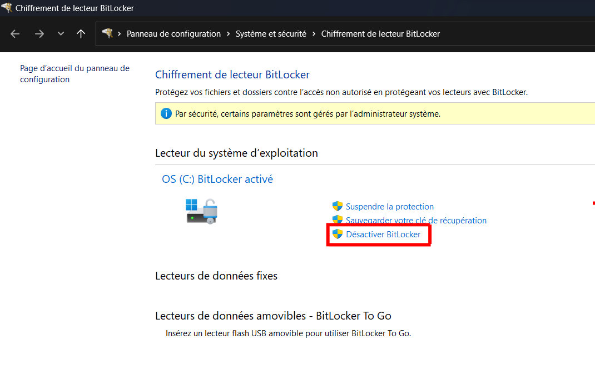

*Désactivation de Bitlocker sous Windows 11 (l'interface peut varier selon les versions de Windows)*

### 2 - Libérer de l'espace dans la table de partitions

Fedora devra être installé dans une [partition](https://fr.wikipedia.org/wiki/Partition_(informatique)) de votre disque. Un disque dur peut être divisé en plusieurs partitions pouvant contenir différent [systèmes de fichiers](https://fr.wikipedia.org/wiki/Syst%C3%A8me_de_fichiers). Nous devons donc libérer de l'espace dans ce que l'on appelle la **table de partitions**. 
Il est recommandé de le faire depuis windows, pour éviter des perdre des données en libérant de l'espace, en effet Windows ne vous laissera pas supprimer des fichiers sur sa propre partition.

Pour commencer, ouvrez le **Gestionnaire de disques** de Windows (son nom sera probablement **Créer et formater des partitions de disque dur**). Depuis ce gestionnaire, dans la zone du bas (en rouge), vous verrez la liste des partitions de votre disque. 

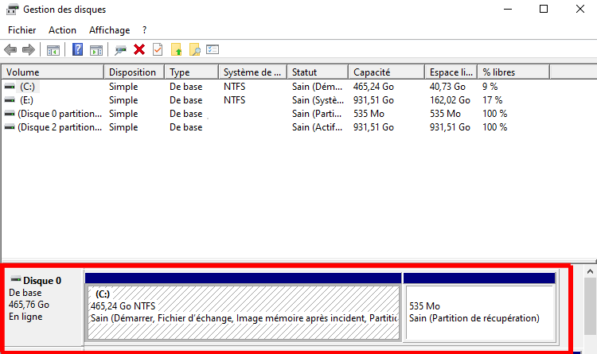

Vous pouvez alors réduire la partition où se trouve windows. La plupart du temps, ce sera **C:**. Pour être sur de réduire la bonne partition, vous devez chercher une partition de grande taille (souvent la plus grande), avec **NTFS** comme système de fichier indiqué. 

Faites un clique droit dessus, et cliquez sur **réduire le volume**. Vous devez alors indiquer la taille que vous voulez pour la future partition qui contiendra Linux. Pour cela, renseignez cette taille (en Mo) dans le champ *Quantité d'espace à réduire*.

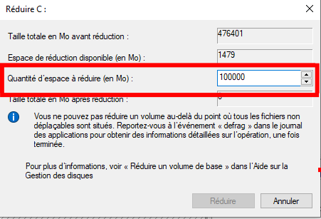

Une fois la partition réduite, vous devrize avoir de l'espace libre, sur lequel on pourra installer linux.

### 3 - Création du medium d'installation

Munissez vous de votre clé USB, et téléchargez le [fichier iso](https://fr.wikipedia.org/wiki/Image_disque) de Fedora, disponible sur [leur site](https://fedoraproject.org/fr/workstation/). 

Nous allons ensuite installer **Ventoy** sur la clé. Ventoy est un outil permettant de faciliter le démarrage de fichiers iso contenant un système d'exploitation sur une clé USB. Téléchargez ventoy depuis [leur site](https://www.ventoy.net/en/download.html), et lancez **Ventoy2Disk**. Séléctionnez votre clé USB (vérifier bien que c'est votre clé et pas un disque de votre dordinateur) et cliquez sur **install**.

> ⚠️ Cette opération supprimera tout le contenu de la clé USB.

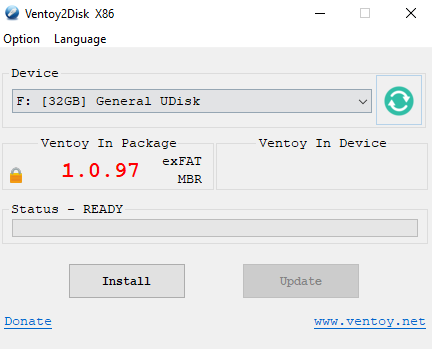

Votre clé dvevrait alors apparaitre dans la liste des disques de l'explorateur de fichiers, avec le nom **VENTOY**. Vous pouvez alors placer le fichier iso de Fedora dans la clé.

Les étapes sous windows sont maintenant terminées !

### 4 - Vérification des paramètres dans le BIOS

Cette partie est la plus difficile à expliquer, parce qu'elle dépend du modèle et de la marque de votre PC.

Vous allez devoir acceder au **BIOS** de votre PC. Le BIOS est un micro système d'exploitation vous permettant de modifier des paramètres du matériel de votre ordinateur. Nous allons devoir modifier et/ou vérifier certains paramètres. Selon la marque l'interface du BIOS peut complètement changer, il est donc possible que les indications données ici ne soient pas réalisable chez vous, où que vous ne trouviez pas les choses demandées, pas de panique, le plus souvent une recherche google avec le modèle de votre PC et le paramètre recherché vous expliquera quoi faire dans ce cas.

> ☝️🤓 Sur la plupart des PC récent, le BIOS est remplacé par l'[UEFI](https://fr.wikipedia.org/wiki/UEFI), qui lui succède. Quand on parle de BIOS, c'est très souvent un abus de langage pour dire UEFI.

La première chose à faire est d'éteindre votre PC, puis de l'allumer, et lors du démarrage, quand vous voyez le premier logo (celui de la marque de l'ordinateur), appuyer sur la touche permettant d'accéder au BIOS. Cette touche varie selon les marques et les modèles. Cette image indique les touche des marques les plus populaires. Si votre PC n'est pas sur l'image, ou que la touche ne marche pas, n'hésitez pas à chercher sur internet.

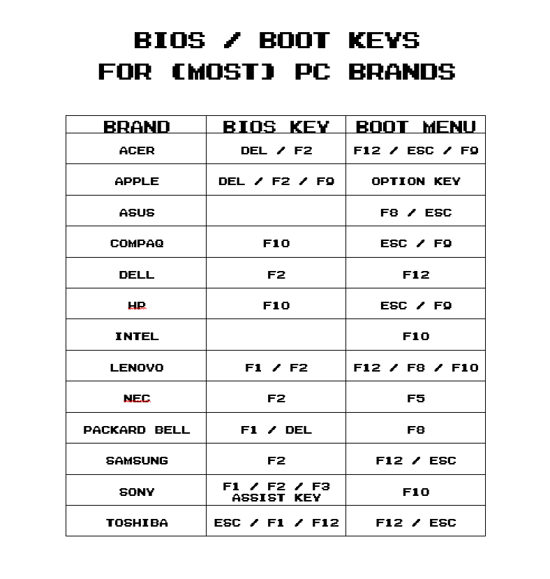

Une fois dans le BIOS, vous devriez être face à écran, qui peut ressembler à ça (ou non, selon votre PC) :

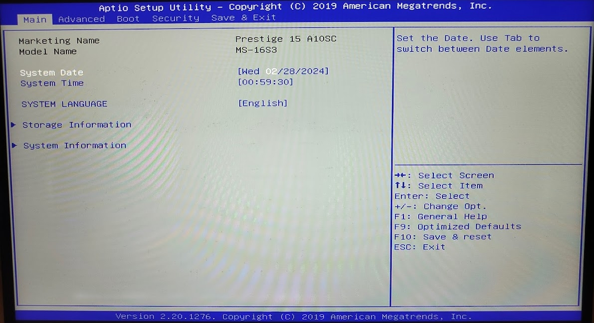

Il faut alors trouver la catégorie **boot** (ou un nom similaire), et trouver ce que l'on appelle **l'ordre de boot**. Cet ordre définit que quel disque l'ordinateur va essayer de cherger un système d'exploitation en premier. On veut donc mettre la clé usb contenant Fedora en premier.

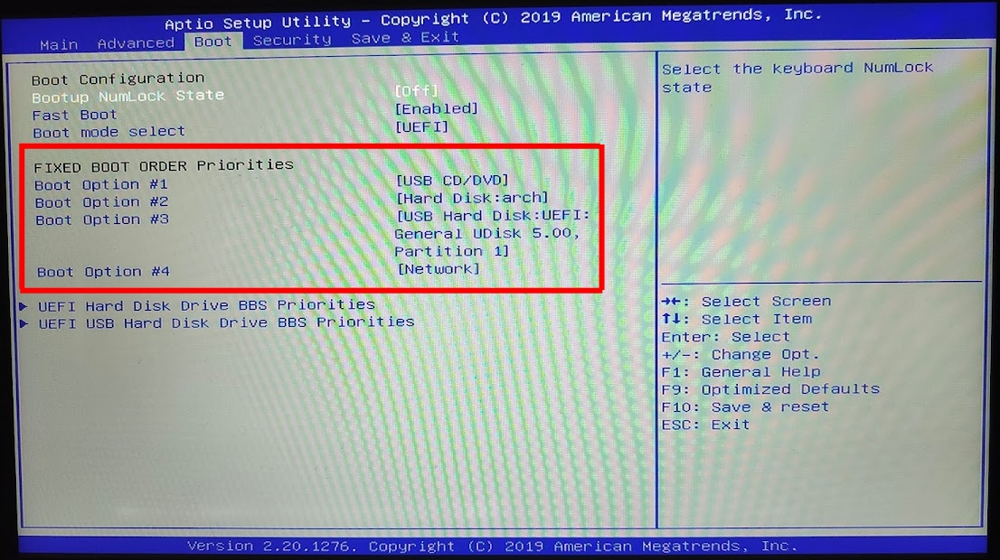

Une fois cela fait, vous pouvez sauvegarder et quitter le BIOS.

Il est possible qu'un message d'affiche pour vous prévenir que la clé n'est pas vérifiée. Continuez, et attendez que l'ordinateur démarre sur la clé. L'ISO de Fedora sur la clé sera utilisé comme système d'exploitation pour l'ordinateur. La clé contient un Fedora totalement fonctionnel, avec une application permettant l'installation sur le vrai disque dur de l'ordinateur.

Lors du démarrage sur la clé, vous verrez tout d'abord un écran de séléction de Ventoy où vous pourrez choisir de démarrer sur Fedora. Vous verrez ensuite un deuxième écran de séléction, où il faut choisir la première entrée (pas l'entrée séléctionnée par defaut)

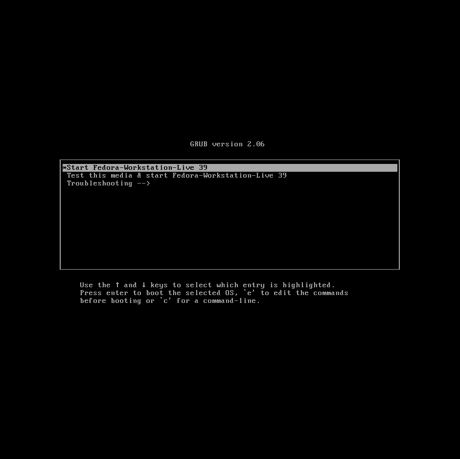

### 5 - Installation

Après avoir démaré la clé, vous devriez voir un bureau linux avec un logiciel d'installation. Cliquez sur **Install Fedora**, puis séléctionnez votre langue.

Cliquez alors sur **Installation Destination**. Vous verrez alors un écran vous montrant vos disques. Dans *configuration du stockage*, cliquez sur **personnalisé** puis validez avec le bouton **fait**

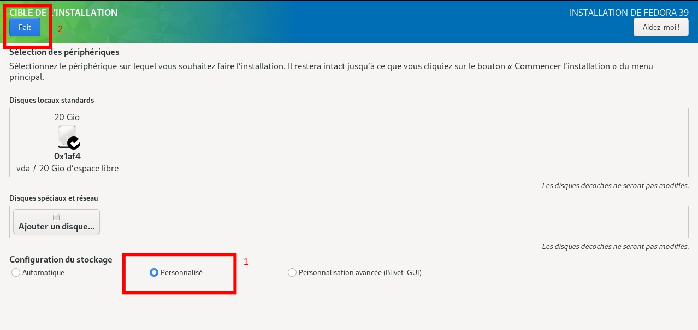

Vous allez maintenant devoir créer deux partitions pour Fedora. La première est nécessaire pour déparer tout ce qui est lié au démarrage du reste du système, et la deuxième contiendra le système. Cliquez sur le **+** en bas, et rentrez `/boot/efi` dans le champ *Point de montage* et `1G` dans le champ *Capacité souhaitée*. Cela permet de créer une partition de 1 Go, qui sera montée dans le système de fichier de linux au chemin `/boot/efi`.

> ⚠️ Le clavier sera en **qwerty** sur le système présent sur la clé USB. Le `/` correspond à la touche `!` d'un azerty, et le `!` correspond au `1` en azerty.

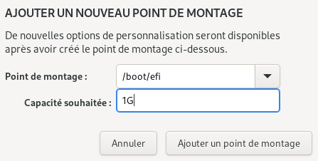

Il faut ensuite créer la partition racine du système, qui occupera tout le reste de l'espace. Cliquez à nouveau sur le **+**, et rentrez `/` dans *Point de montage* et `!` dans *Capacité souhaitée*. Le `!` permet d'allouer tout l'espace restant. 

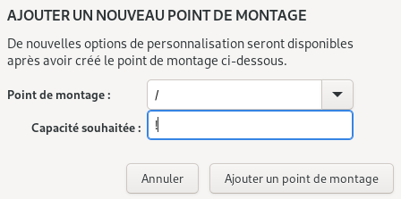

Une fois que tout est fait, cliquez sur **fait**, et cliquez sur **Commencer l'installation**.

Lorsque l'installation sera terminée, vous pourrez redémarrer votre PC, et débrancher la clé. Vous devriez alors voir un écran de séléction vous demandant de choisir entre Windows et Fedora.

### 6 - Post Installation

Après l'installation, une fenêtre de configuration d'affichera. Plusieurs opention peuvent être activées ou non, et ces valeurs peuvent être changées à nouveau à tout moment dans les paramètres.

- Choisissez si vous voulez activer la localisation et l'envoi de rapports de crash
- Nous vous conseillons d'activer les dépots tiers, qui vous permettent d'avoir plus de choix de programmes à installer, dont certains sont utiles pour les cours d'informatique.
- Pour votre nom d'utilisateur, il est conseillé d'utiliser votre prénom, en minuscule. Le nom complet n'est pas important.
- Choisissez un mot de passe.

Votre système est maintenant totalement utilisable, mais il y a plusieurs éléments important à savoir:

**Mettez régulièrement à jour votre système !** Pour cela, vous pouvez ouvrir un terminal et taper la commande :

```sh
sudo dnf update
```

> ☝️🤓 `sudo` est une commande permettant de lancer d'autres commandes en mode administrateur. Pour protéger votre système, votre utilisateur par défaut n'a pas toutes les permissions, mais pour faire des mises à jour, il est obligatoire d'être administrateur du système.

> ℹ️ Quand on vous demande d'entrer votre mot de passe dans le terminal, il est normal que vous ne voyiez pas les caractères que vous tapez au clavier, c'est un mécanisme de protection de linux, pour éviter qu'une personne devine la longueur de votre mot de passe en regardant votre écran derrière vous.

Des questions vous seront posées pour confirmer les mises à jour, vous pouvez répondre oui avec la lettre **O** en majuscule.

La première mise à jour du système peut prendre du temps, mais le reste du temps, les mises à jour devraient être plus rapide si vous les faites régulièrement (environs une fois par semaine). Il est important de mettre à jour votre système pour éviter les problèmes de compatibilité lorsque vous installez de nouveaux programmes. Cela permet également une meilleure sécurité.

**Pour installer un programme**, il faut taper la commande :

```sh
sudo dnf install nom_du_programme
```

Vous pouvez trouver le nom précis du programme avec :

```sh
dnf search nom_recherché
```

Il est également possible de chercher le nom d'un programme [ici](https://packages.fedoraproject.org/).

> ℹ️ Il est également possible de faire les mises à jour et d'installer les programmes via l'interface graphique **Logiciels**, présent par défaut sur Fedora, mais ce n'est pas recommandé, en effet, il sera alors difficile de comprendre d'où vient un problème de mise à jour en l'absence de logs dans le terminal.

### 7 - Ajouts optionnels

Certains programmes comme discord ne sont pas installable par défaut avec `dnf`. Vous pouvez ajouter des dépots supplémentaires appelé [RPM Fusion](https://doc.fedora-fr.org/wiki/D%C3%A9p%C3%B4t_RPM_Fusion) permettant d'ajouter des paquets supplémentaires. L'installation est très simple, il suffit de taper ces commandes dans le terminal, à la suite :

```sh
sudo dnf install https://download1.rpmfusion.org/free/fedora/rpmfusion-free-release-$(rpm -E %fedora).noarch.rpm
```
```sh
sudo dnf install https://download1.rpmfusion.org/nonfree/fedora/rpmfusion-nonfree-release-$(rpm -E %fedora).noarch.rpm
```

**Visual Studio Code** n'est ni présent sur les dépots de Fedora, ni sur RPM Fusion. Pour l'installer, il faut d'abord ajouter [les dépots de Microsoft](https://code.visualstudio.com/docs/setup/linux#_rhel-fedora-and-centos-based-distributions) :

```sh
sudo rpm --import https://packages.microsoft.com/keys/microsoft.asc
```

```sh
sudo sh -c 'echo -e "[code]\nname=Visual Studio Code\nbaseurl=https://packages.microsoft.com/yumrepos/vscode\nenabled=1\ngpgcheck=1\ngpgkey=https://packages.microsoft.com/keys/microsoft.asc" > /etc/yum.repos.d/vscode.repo'
```

```sh
sudo dnf check-update
```

Vous pouvez maintenant installer VSCode avec :

```sh
sudo dnf install code
```
