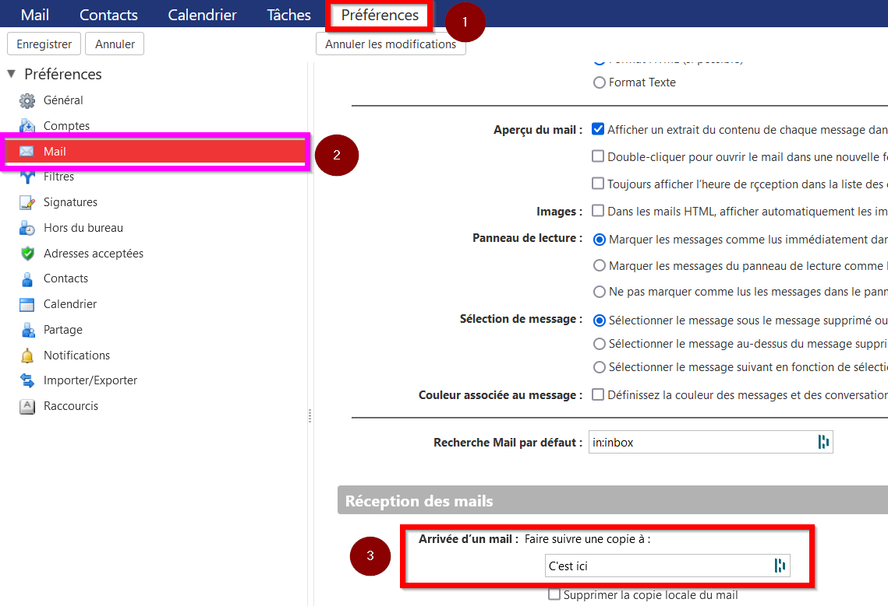

# Simplifier ses accès aux mails Sorbonne

## Synchroniser sa boîte mail UPMC

Il peut être difficile d'utiliser Zimbra, dans cet article nous verrons comment synchroniser votre boîte mail de l'université avec votre boîte mail principale.

Nous allons ici se connecter aux serveurs mails, ce qui vous permettra aussi de répondre et de gérer votre boîte mail directement via votre application de messagerie préférée sans jamais plu avoir à vous connecter sur la plateforme Zimbra.

Dans votre application favorite, suivez ces étapes attentivement:

### Ajoutez une nouvelle adresse email de type [**IMAP**](https://fr.wikipedia.org/wiki/Internet_Message_Access_Protocol)

>💡 Si cette option n'existe pas, appuyez sur "autre" ;)

>💡 S'il est possible de le faire n'oubliez pas de cochez les cases types: "paramètres avancés/configuration manuelle"

### Renseignez le **_serveur mail entrant_**

**Serveur**: `imaps.sorbonne-universite.fr`  
**Port**: `993`  
**Mot de passe**: Le même que vous utilisez pour vous connecter sur les sites UPMC

⚠️ Si cela est requis **n'oubliez pas** d'activer l'authentification [**SSL**](https://www.websecurity.digicert.com/security-topics/what-is-ssl-tls-https) ou **SSL/TLS** (et non pas juste TLS)

>💡 S'il faut renseigner un nom d'utilisateur, il s'agira ici de votre adresse e-mail étudiante

### Renseignez le **_serveur mail sortant_** ([SMTP](https://en.wikipedia.org/wiki/Simple_Mail_Transfer_Protocol))

**Serveur**: `smtps.sorbonne-universite.fr`  
**Port**: `465`  
**Nom d'utilisateur**: Votre numéro étudiant  
**Mot de passe**: Le même que vous utilisez pour vous connecter sur les sites UPMC  

⚠️ Une fois de plus, si cela est requis **n'oubliez pas** d'activer l'authentification **SSL** ou **SSL/TLS** (et non pas juste TLS)  

Et voilà ! C'est terminé !

## Transférer ses mails UPMC vers sa boîte principal

Nous allons dans cet article voir rapidement comment nous pouvons mettre votre adresse principal en copie des mails de votre boîte Zimbra.

Ceci est très rapide et vous évitera de vous connecter à Zimbra pour lire vos mails.

⚠️ Si vous souhaitez pouvoir répondre au mail avec votre mail étudiant et avoir un contrôle sur l'ensemble de votre boîte mail, il est mieux de suivre l'article ["Synchroniser sa boîte mail UPMC"](#synchroniser-sa-boîte-mail-upmc)

Connectez-vous à Zimbra puis allez dans préférences.  
Rendez-vous ensuite dans l'onglet mail situé sur le côté gauche.  
Renseignez ensuite votre mail dans la rubrique *Réception des mails*, dans la case *Faire suivre une copie à*

Voici un schéma des différentes étapes abordées, vous remarquerez que ça se fait vraiment en trois clics :p

