# Simplifier ses accès aux mails Sorbonne

## Synchroniser sa boîte mail Sorbonne

Il peut être difficile d'utiliser Zimbra, dans cet article nous verrons comment synchroniser votre boîte mail de l'université avec votre client mail principal.

Nous allons ici se connecter aux serveurs mails, ce qui vous permettra aussi de répondre et de gérer votre boîte mail directement via votre application de messagerie préférée sans jamais plus à avoir à vous connecter sur la plateforme Zimbra.

Dans votre application favorite, suivez ces étapes attentivement:

### Ajoutez une nouvelle adresse email de type [**IMAP**](https://fr.wikipedia.org/wiki/Internet_Message_Access_Protocol)

>💡 Si cette option n'existe pas, appuyez sur "autre" ;)

>💡 S'il est possible de le faire n'oubliez pas de cocher les cases types: "paramètres avancés/configuration manuelle"

### Renseignez le **_serveur mail entrant_**

**Serveur**: `imaps.sorbonne-universite.fr`  
**Port**: `993`  
**Nom d'utilisateur**: Votre numéro étudiant  
**Mot de passe**: Le même que vous utilisez pour vous connecter sur Moodle

⚠️ Si cela est requis **n'oubliez pas** d'activer l'authentification [**SSL**](https://www.websecurity.digicert.com/security-topics/what-is-ssl-tls-https) ou **SSL/TLS** (et non pas juste TLS)

### Renseignez le **_serveur mail sortant_** ([SMTP](https://en.wikipedia.org/wiki/Simple_Mail_Transfer_Protocol))

**Serveur**: `smtps.sorbonne-universite.fr`
**Port**: `465`
**Nom d'utilisateur**: Votre numéro étudiant
**Mot de passe**: Le même que vous utilisez pour vous connecter sur Moodle

⚠️ Une fois de plus, si cela est requis **n'oubliez pas** d'activer l'authentification **SSL** ou **SSL/TLS** (et non pas juste TLS)

Et voilà ! C'est terminé !

## Exemple Gmail (mobile)

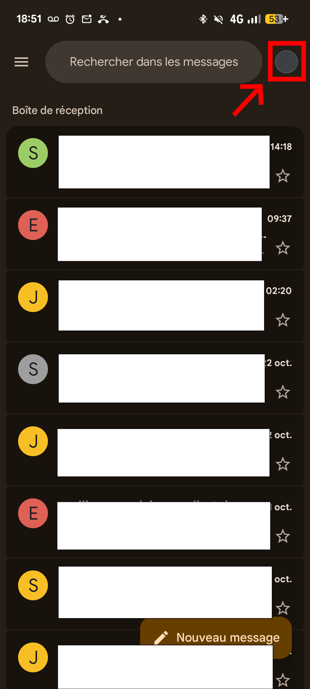
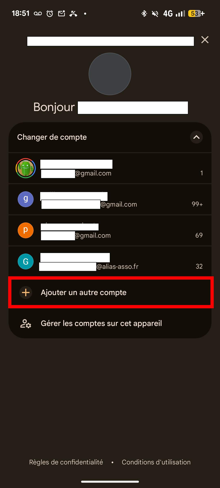
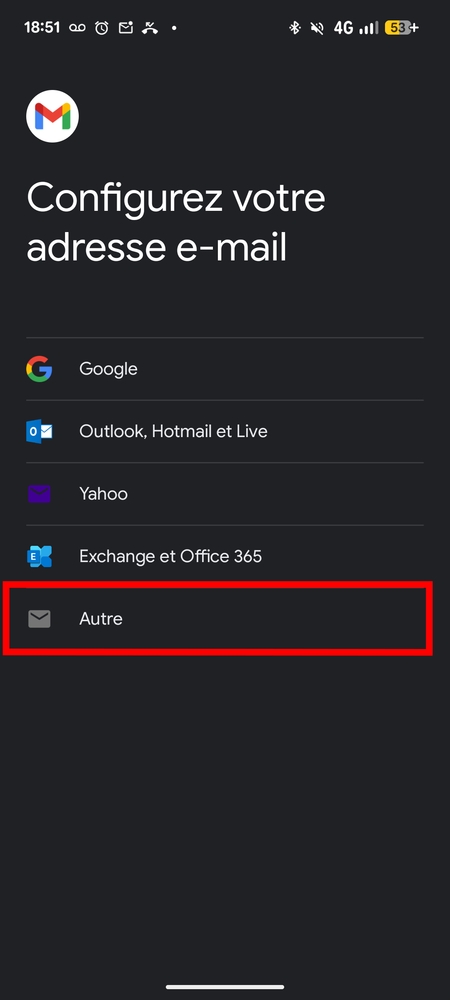
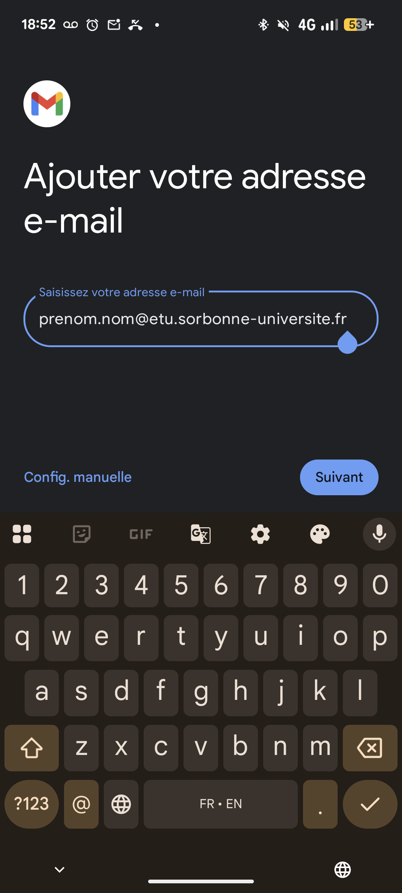

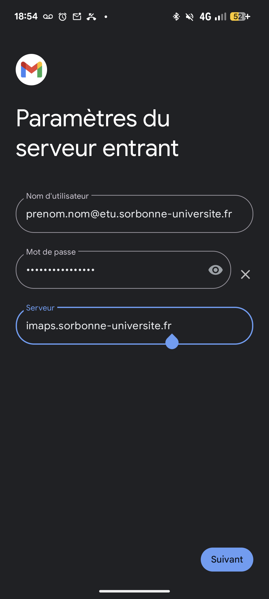
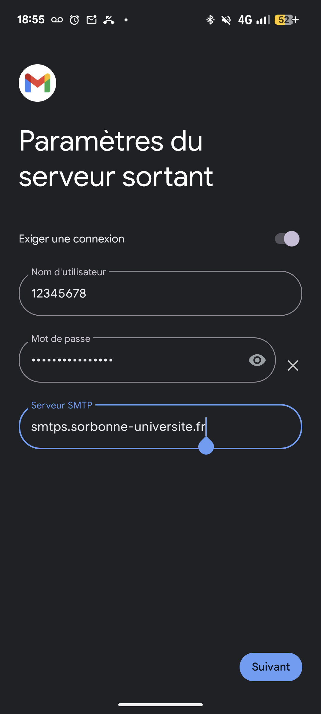

## Exemple Thunderbird (desktop)

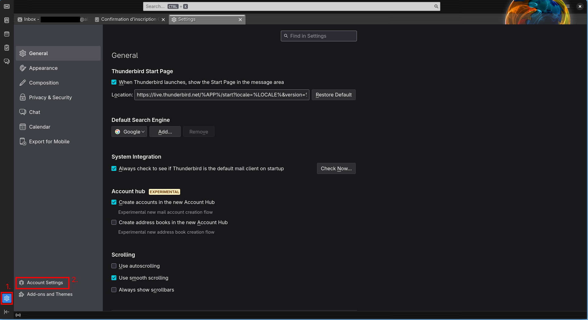
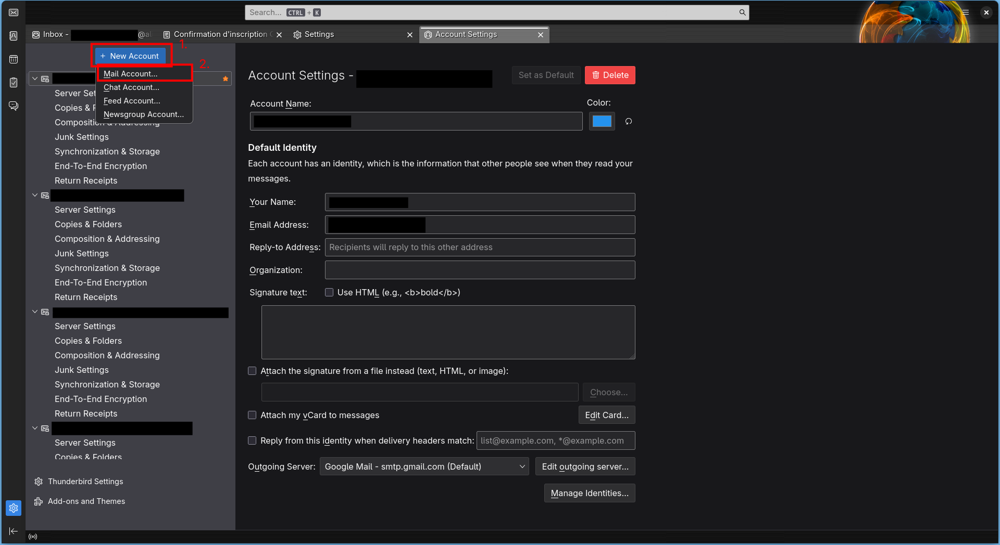
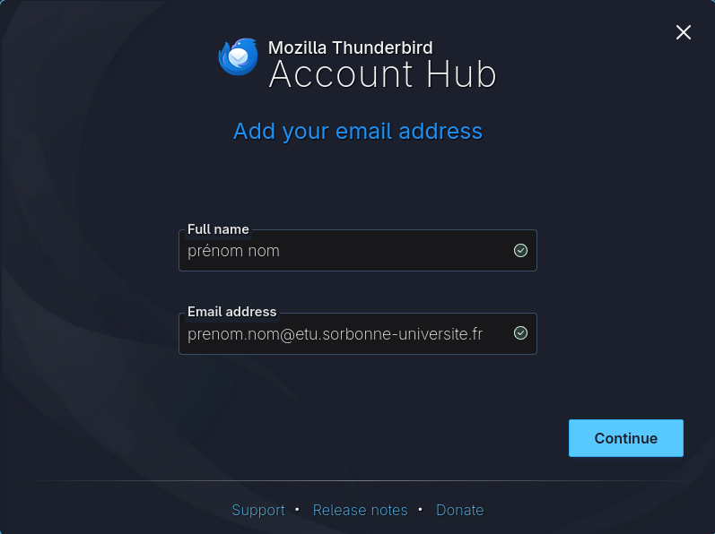
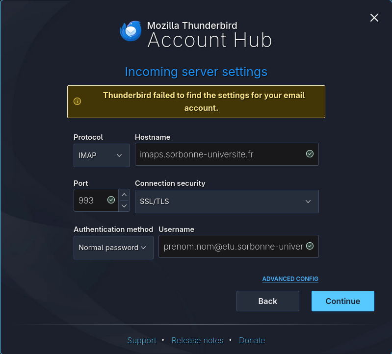
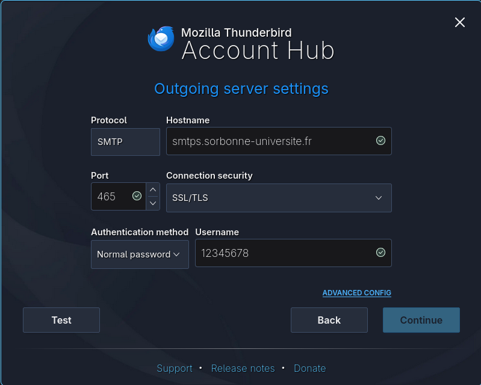
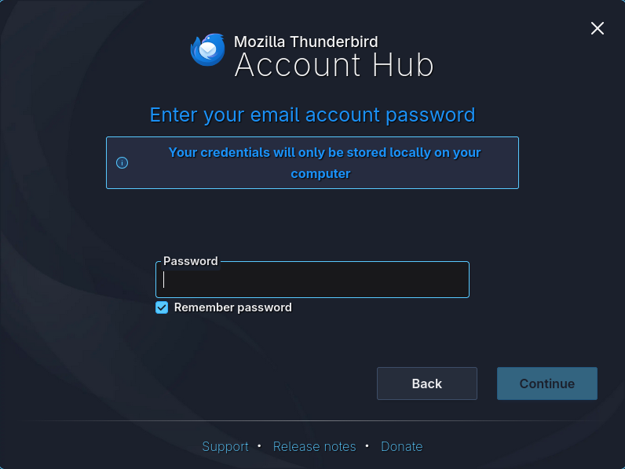
